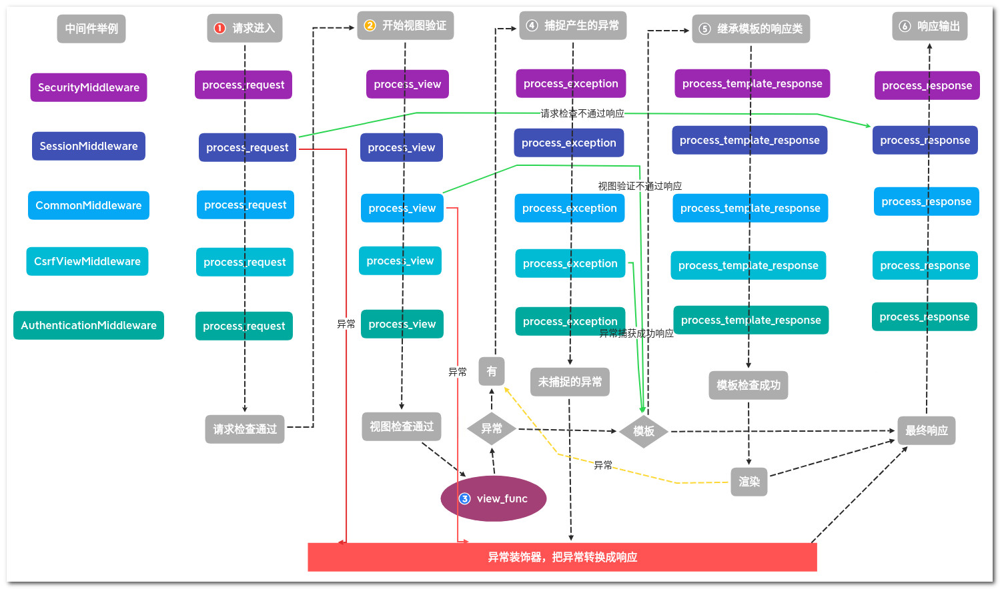

[TOC]
## 摘要
在开发和调试中我们使用`Django`的命令`runserver`来启动项目，而在正式环境中一般会使用`nginx + uwsgi`启动项目。无论哪种方式都会做两件事: 1.创建一个`WSGIServer`服务来处理客户端的连接。2.提供一个`WSGIHandler`用于处理请求并返回响应。今天我们一起看看`Django`是怎么处理第二步的。
## Wsgi
### 入口
`Django`支持`wsgi`的入口
```python
# wsgi.py
import os
from django.core.wsgi import get_wsgi_application
# 设置系统环境中的 django 配置文件路径，django 导入配置文件会用到
os.environ.setdefault('DJANGO_SETTINGS_MODULE', 'kaixin.settings')
# 创建 wsgi 使用的 application 对象
application = get_wsgi_application()
```
```python
# django.core.wsgi.py
import django
from django.core.handlers.wsgi import WSGIHandler

def get_wsgi_application():
    django.setup(set_prefix=False)
    return WSGIHandler()
```
### Django 环境初始化
```python
# django.__init__.py
def setup(set_prefix=True):
    # 导入单例模式的 apps 对象
    from django.apps import apps
    # 导入单例模式的 settings 对象
    from django.conf import settings
    # 日志配置方法
    from django.utils.log import configure_logging

    # 根据配置文件配置日志
    configure_logging(settings.LOGGING_CONFIG, settings.LOGGING)
    # 把配置中的app注册到单例对象中，线程安全，幂等和不可重入的
    apps.populate(settings.INSTALLED_APPS)
        # 第一阶段 初始化app配置类，并导入app模块
        for entry in installed_apps:
            if isinstance(entry, AppConfig):
                app_config = entry
            else:
                app_config = AppConfig.create(entry)
            if app_config.label in self.app_configs:
                raise ImproperlyConfigured(
                    "Application labels aren't unique, "
                    "duplicates: %s" % app_config.label)

            self.app_configs[app_config.label] = app_config
            app_config.apps = self
        # 第二阶段 导入app模块中的模型(如果有)
        for app_config in self.app_configs.values():
            app_config.import_models()

        # 第三阶段 运行app模块配置类的 ready 方法检查或者初始化一些设置
        for app_config in self.get_app_configs():
            app_config.ready()
```
### application 初始化
```python
#django.core.handlers.wsgi
class WSGIHandler(base.BaseHandler):
    request_class = WSGIRequest
    def __init__(self, *args, **kwargs):
        super().__init__(*args, **kwargs)
		# 加载中间件
        self.load_middleware()
```
```python
#django.core.handlers.base
class BaseHandler:
    def load_middleware(self):
        self._view_middleware = []
        self._template_response_middleware = []
        self._exception_middleware = []

        # 异常装饰器，把产生的异常转换成响应对象
        handler = convert_exception_to_response(self._get_response)
        # 中间件倒叙处理，这样才能保证请求进来的时候是按照顺序经过中间件
        for middleware_path in reversed(settings.MIDDLEWARE):
            # 导入中间件
            middleware = import_string(middleware_path)
            # 实例化中间件对象，参数是下一层中间件的对象(因为是倒叙处理)
            try:
                mw_instance = middleware(handler)
            except MiddlewareNotUsed as exc:
                ...
                continue

            if mw_instance is None:
                raise ImproperlyConfigured(
                    'Middleware factory %s returned None.' % middleware_path
                )

            # 如果中间键存在视图处理方法，添加进视图中间件列表
            if hasattr(mw_instance, 'process_view'):
                self._view_middleware.insert(0, mw_instance.process_view)
            # 如果中间件存在模板响应处理方法，添加进模板中间件列表
            if hasattr(mw_instance, 'process_template_response'):
                self._template_response_middleware.append(mw_instance.process_template_response)
            # 如果中间件存在异常处理方法，添加进异常处理中间件列表
            if hasattr(mw_instance, 'process_exception'):
                self._exception_middleware.append(mw_instance.process_exception)

            # 把中间件对象使用异常转换装饰器包装
            handler = convert_exception_to_response(mw_instance)

        # 设置最终的中间处理链
        self._middleware_chain = handler
```
### 初始化完成
初始化内容

- 设置系统环境中的`django`配置文件
- 加载配置文件
- 根据配置文件设置日志格式
- 根据配置文件注册`app`模块并检查(导入模块与模型)
- 初始化`application`对象，加载中间件

## 接收请求
`application`是一个可调用的`WSGIHandler`类的实例化对象，由`WsgiServer`调用。它接收两个参数，一个环境变量`environ`，一个设置响应头的方法`start_response`。返回结果是一个`response`对象。
```python
class WSGIHandler(base.BaseHandler):
    request_class = WSGIRequest

    def __call__(self, environ, start_response):
        # 设置脚本前缀
        set_script_prefix(get_script_name(environ))
        signals.request_started.send(sender=self.__class__, environ=environ)
        # 根据环境变量创建请求对象
        request = self.request_class(environ)
        # 获取响应内容
        response = self.get_response(request)
        response._handler_class = self.__class__

        # 响应状态
        status = '%d %s' % (response.status_code, response.reason_phrase)
        # 响应首部
        response_headers = [
            *response.items(),
            *(('Set-Cookie', c.output(header='')) for c in response.cookies.values()),
        ]
        # 设置响应状态和响应首部
        start_response(status, response_headers)
        # 发送文件的装饰
        if getattr(response, 'file_to_stream', None) is not None and environ.get('wsgi.file_wrapper'):
            response = environ['wsgi.file_wrapper'](response.file_to_stream)
        # 返回响应
        return response
```
## 处理请求
`application`根据环境创建的请求对象`request`从上往下经过中间件层层处理到达最底部的`_get_response`方法。经过`_get_response`方法返回的`response`对象再从下往上经过层层中间件返回给`application`。
```python
class BaseHandler:
    def make_view_atomic(self, view):
        non_atomic_requests = getattr(view, '_non_atomic_requests', set())
        for db in connections.all():
            if db.settings_dict['ATOMIC_REQUESTS'] and db.alias not in non_atomic_requests:
                view = transaction.atomic(using=db.alias)(view)
        return view

    def get_response(self, request):
        # 设置此线程的默认url解析器
        set_urlconf(settings.ROOT_URLCONF)
        # 使用中间件处理请求
        response = self._middleware_chain(request)
        response._closable_objects.append(request)
        # 如果状态大于400 记录日志
        if response.status_code >= 400:
            log_response(
                '%s: %s', response.reason_phrase, request.path,
                response=response,
                request=request,
            )
        # 返回响应
        return response

    def _get_response(self, request):
        response = None

        # 获取url解析器
        if hasattr(request, 'urlconf'):
            urlconf = request.urlconf
            set_urlconf(urlconf)
            resolver = get_resolver(urlconf)
        else:
            resolver = get_resolver()

        # 匹配请求
        resolver_match = resolver.resolve(request.path_info)
        # url匹配到的 视图方法与参数
        callback, callback_args, callback_kwargs = resolver_match
        request.resolver_match = resolver_match

        # 如果存在视图中间件则调用他们
        for middleware_method in self._view_middleware:
            response = middleware_method(request, callback, callback_args, callback_kwargs)
            if response:
                break

        # 中间件没有产生异常，继续执行
        if response is None:
            # 执行我们自己编写的视图方法
            wrapped_callback = self.make_view_atomic(callback)
            try:
                response = wrapped_callback(request, *callback_args, **callback_kwargs)
            # 如果产生了异常则使用异常中间件处理
            except Exception as e:
                response = self.process_exception_by_middleware(e, request)

        # 如果我们视图没有返回数据，则抛出异常
        if response is None:
            if isinstance(callback, types.FunctionType):    # FBV
                view_name = callback.__name__
            else:                                           # CBV
                view_name = callback.__class__.__name__ + '.__call__'

            raise ValueError(
                "The view %s.%s didn't return an HttpResponse object. It "
                "returned None instead." % (callback.__module__, view_name)
            )

        # 如果响应支持延迟呈现，加载模板中间件
        elif hasattr(response, 'render') and callable(response.render):
            for middleware_method in self._template_response_middleware:
                response = middleware_method(request, response)
                # Complain if the template response middleware returned None (a common error).
                if response is None:
                    raise ValueError(
                        "%s.process_template_response didn't return an "
                        "HttpResponse object. It returned None instead."
                        % (middleware_method.__self__.__class__.__name__)
                    )

            try:
                response = response.render()
            except Exception as e:
                response = self.process_exception_by_middleware(e, request)

        return response

    # 将异常传递给异常中间件
    def process_exception_by_middleware(self, exception, request):
        for middleware_method in self._exception_middleware:
            response = middleware_method(request, exception)
            if response:
                return response
        raise
```
## 中间件流程图
