[TOC]
## 摘要
`Sublime Text`具有漂亮的用户界面和强大的功能，例如代码缩略图，`Python`插件，代码段等。还可以自定义键绑定，菜单和工具栏。`Sublime Text`的主要功能包括：拼写检查，书签，完整的`Python API`，`GOTO`功能，即时项目切换，多选择，多窗口等等。`Sublime Text`是一个跨平台的编译器，同时支持`Windows`、`Linux`、`Mac OSX`等操作系统。  --来自百度百科
## 下载
进入sublime官网点击Linux64位下载(根据自己的系统选择)，[下载地址](http://www.sublimetext.com/3)。
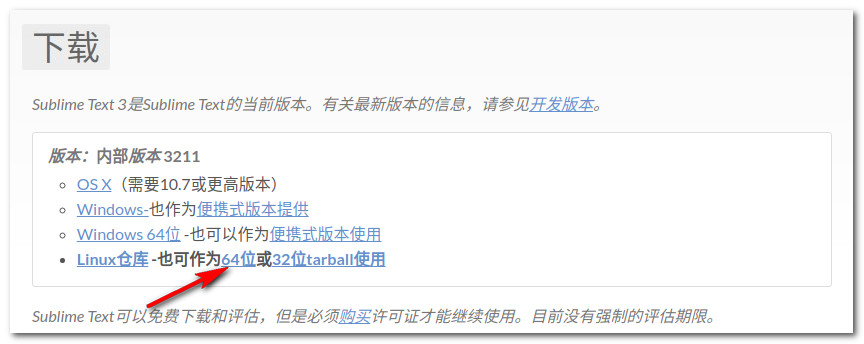
## 安装
1. 把压缩包解压到用户主目录
2. 更改解压后的文件夹名称
3. 把可执行程序链接到系统搜索路径
4. 执行

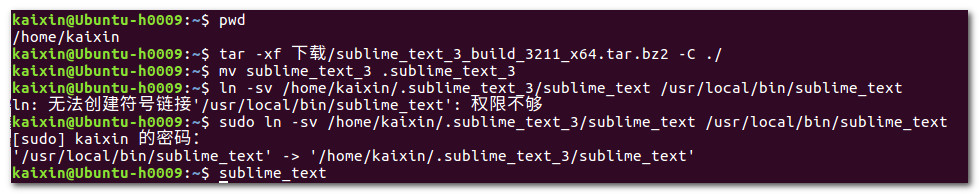

## 安装 package control
打开sublime点击tools点击install package control，待安装完后选择preferences可以看到结果。
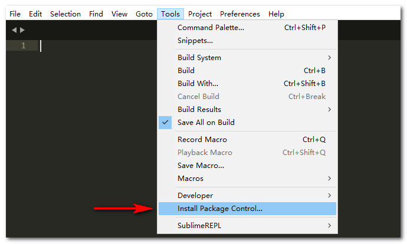
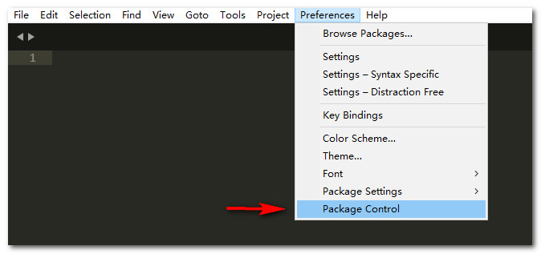

## 支持中文
点击 preferences -> package control -> install package 输入 localizedMenu 点击安装
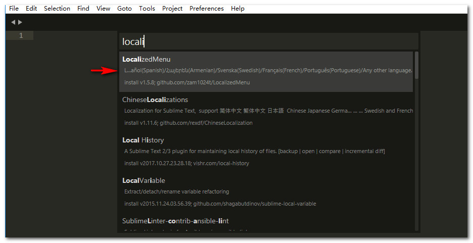  
安装完成后点击 preferences -> languages -> 简体中文
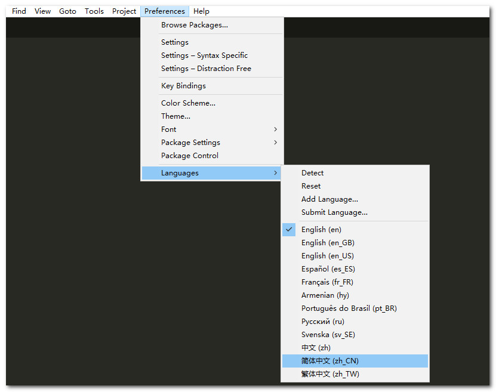

## 插件 SublimeREPL
点击 设置 -> package control -> install package 输入 sublimere
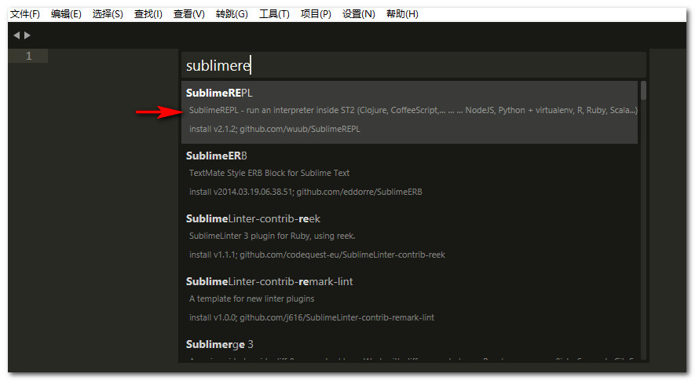
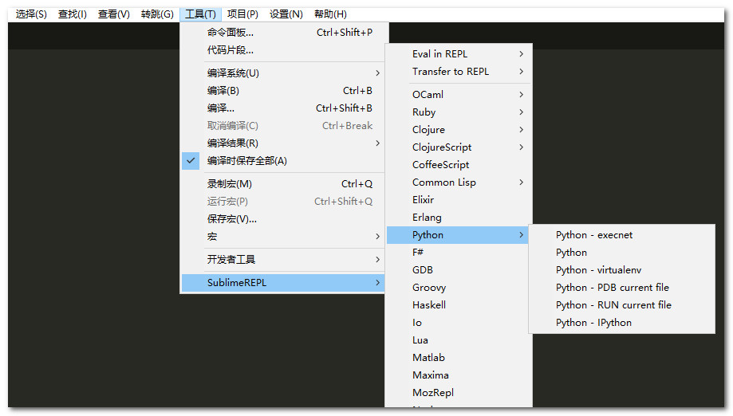

## sumlime 支持 Python3 语法
### 安装插件
点击 设置 -> Package Control -> Install Package 输入  python
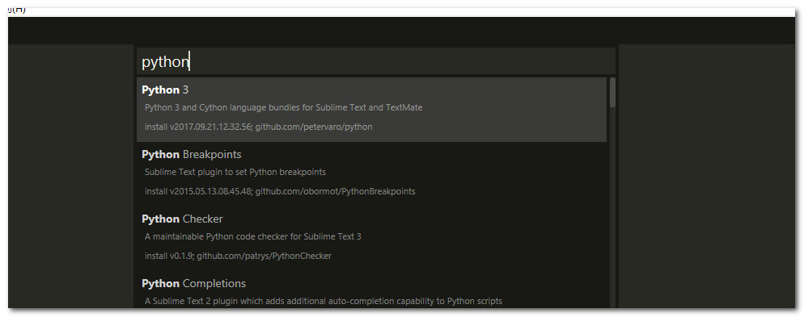  
安装之后sublime就可以支持python 3 语法  
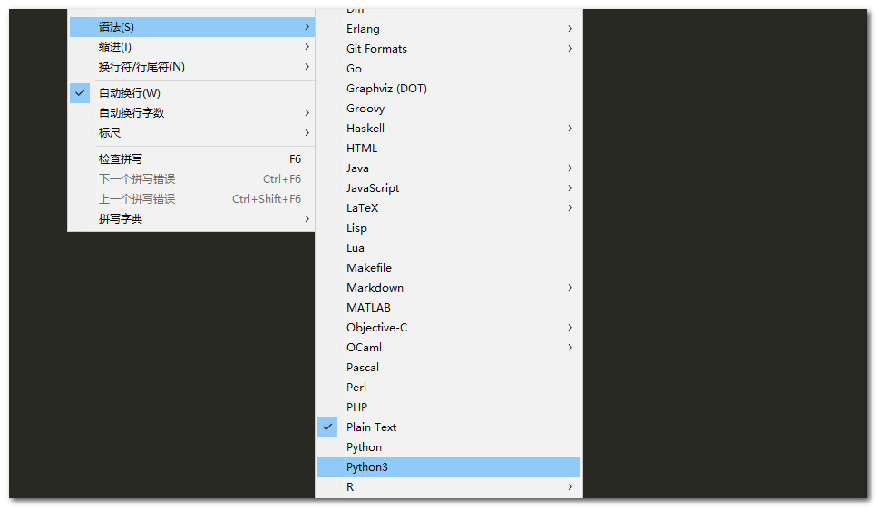
### 切换语法
使用的时候注意切换语法，语法在右下角设置。  
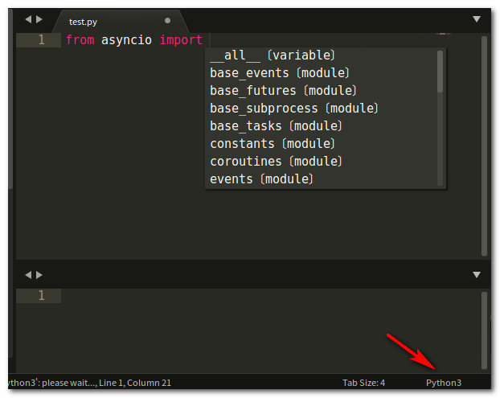

## 配置sublime支持 py2 and py3
### 更改配置文件
点击 设置 -> 浏览插件目录 -> SublimeREPL -> config -> Python 打开文件 Main.sublime-menu
根据以下配置更改文件内容，其中python2和python3的路径根据自己的安装路径修改
```python
[
    {
        "id": "tools",
        "children":
        [
            {
                "caption": "SublimeREPL",
                "mnemonic": "R",
                "id": "SublimeREPL",
                "children":
                [
                    {
                        "caption": "Python",
                        "id": "Python",
                        "children":
                        [
                            {
                                "command": "repl_open",
                                "caption": "Python",
                                "id": "repl_python",
                                "mnemonic": "P",
                                "args": {
                                    "type": "subprocess",
                                    "encoding": "utf8",
                                    "cmd": ["/home/kaixin/.pyenv/versions/py27/bin/python", "-i", "-u"],
                                    "cwd": "$file_path",
                                    "syntax": "Packages/Python/Python.tmLanguage",
                                    "external_id": "python",
                                    "extend_env": {"PYTHONIOENCODING": "utf-8"}
                                }
                            },
                            {
                                "command": "python_virtualenv_repl",
                                "id": "python_virtualenv_repl",
                                "caption": "Python - virtualenv"
                            },
                            {
                                "command": "repl_open",
                                 "caption": "Python - PDB current file",
                                 "id": "repl_python_pdb",
                                 "mnemonic": "D",
                                 "args": {
                                    "type": "subprocess",
                                    "encoding": "utf8",
                                    "cmd": ["/home/kaixin/.pyenv/versions/py27/bin/python", "-i", "-u", "-m", "pdb", "$file_basename"],
                                    "cwd": "$file_path",
                                    "syntax": "Packages/Python/Python.tmLanguage",
                                    "external_id": "python",
                                    "extend_env": {"PYTHONIOENCODING": "utf-8"}
                                }
                            },
                            {
                                "command": "repl_open",
                                 "caption": "Python - RUN current file",
                                 "id": "repl_python_run",
                                 "mnemonic": "R",
                                 "args": {
                                    "type": "subprocess",
                                    "encoding": "utf8",
                                    "cmd": ["/home/kaixin/.pyenv/versions/py27/bin/python", "-u", "$file_basename"],
                                    "cwd": "$file_path",
                                    "syntax": "Packages/Python/Python.tmLanguage",
                                    "external_id": "python",
                                    "extend_env": {"PYTHONIOENCODING": "utf-8"}
                                }
                            },
                            {
                                "command": "repl_open",
                                "caption": "Python - IPython",
                                "id": "repl_python_ipython",
                                "mnemonic": "I",
                                "args": {
                                    "type": "subprocess",
                                    "encoding": "utf8",
                                    "autocomplete_server": true,
                                    "cmd": {
                                        "osx": ["/home/kaixin/.pyenv/versions/py27/bin/python", "-u", "${packages}/SublimeREPL/config/Python/ipy_repl.py"],
                                        "linux": ["/home/kaixin/.pyenv/versions/py27/bin/python", "-u", "${packages}/SublimeREPL/config/Python/ipy_repl.py"],
                                        "windows": ["/home/kaixin/.pyenv/versions/py27/bin/python", "-u", "${packages}/SublimeREPL/config/Python/ipy_repl.py"]
                                    },
                                    "cwd": "$file_path",
                                    "syntax": "Packages/Python/Python.tmLanguage",
                                    "external_id": "python",
                                    "extend_env": {
                                        "PYTHONIOENCODING": "utf-8",
                                        "SUBLIMEREPL_EDITOR": "$editor"
                                    }
                                }
                            }
                        ]
                    },
                    {
                        "caption": "Python3",
                        "id": "Python3",
                        "children":
                        [
                            {
                                "command": "repl_open",
                                "caption": "Python3",
                                "id": "repl_python3",
                                "mnemonic": "P",
                                "args": {
                                    "type": "subprocess",
                                    "encoding": "utf8",
                                    "autocomplete_server": true,
                                    "cmd": ["/home/kaixin/.pyenv/versions/py37/bin/python", "-i", "-u"],
                                    "cwd": "$file_path",
                                    "syntax": "Packages/Python/Python.tmLanguage",
                                    "external_id": "python3",
                                    "extend_env": {"PYTHONIOENCODING": "utf-8"}
                                }
                            },
                            {
                                "command": "repl_open",
                                "caption": "Python3 - PDB current file",
                                "id": "repl_python3_pdb",
                                "mnemonic": "D",
                                "args": {
                                    "type": "subprocess",
                                    "encoding": "utf8",
                                    "cmd": ["/home/kaixin/.pyenv/versions/py37/bin/python3", "-i", "-u", "-m", "pdb", "$file_basename"],
                                    "cwd": "$file_path",
                                    "syntax": "Packages/Python/Python.tmLanguage",
                                    "external_id": "python3",
                                    "extend_env": {"PYTHONIOENCODING": "utf-8"}
                                }
                            },
                            {
                                "command": "repl_open",
                                "caption": "Python3 - RUN current file",
                                "id": "repl_python3_run",
                                "mnemonic": "R",
                                "args": {
                                    "type": "subprocess",
                                    "encoding": "utf8",
                                    "cmd": ["/home/kaixin/.pyenv/versions/py37/bin/python3", "-u", "$file_basename"],
                                    "cwd": "$file_path",
                                    "syntax": "Packages/Python/Python.tmLanguage",
                                    "external_id": "python3",
                                    "extend_env": {"PYTHONIOENCODING": "utf-8"}
                                }
                            },
                            {
                                "command": "repl_open",
                                "caption": "Python3 - IPython",
                                "id": "repl_python3_ipython",
                                "mnemonic": "I",
                                "args": {
                                    "type": "subprocess",
                                    "encoding": "utf8",
                                    "autocomplete_server": true,
                                    "cmd": {
                                        "osx": ["/home/kaixin/.pyenv/versions/py37/bin/python3", "-u", "${packages}/SublimeREPL/config/Python/ipy_repl.py"],
                                        "linux": ["/home/kaixin/.pyenv/versions/py37/bin/python3", "-u", "${packages}/SublimeREPL/config/Python/ipy_repl.py"],
                                        "windows": ["/home/kaixin/.pyenv/versions/py37/bin/python3", "-u", "${packages}/SublimeREPL/config/Python/ipy_repl.py"],
                                        "ubuntu": ["/home/kaixin/.pyenv/versions/py37/bin/python3", "-u", "${packages}/SublimeREPL/config/Python/ipy_repl.py"]
                                    },
                                    "cwd": "$file_path",
                                    "syntax": "Packages/Python/Python.tmLanguage",
                                    "external_id": "python3",
                                    "extend_env": {
                                        "PYTHONIOENCODING": "utf-8",
                                        "SUBLIMEREPL_EDITOR": "$editor"
                                    }
                                }
                            }
                        ]
                    }
                ]
            }
        ]
    }
]
```
打开 Main.sublime-menu 同目录下的 Default.sublime-commands 文件，在列表的最后增加如下内容
```python
{
	"caption": "SublimeREPL: Python3",
	"command": "run_existing_window_command", "args":
	{
		"id": "repl_python3",
		"file": "config/Python/Main.sublime-menu"
	}
},
{
	"caption": "SublimeREPL: Python3 - PDB current file",
	"command": "run_existing_window_command", "args":
	{
		"id": "repl_python3_pdb",
		"file": "config/Python/Main.sublime-menu"
	}
},
{
	"caption": "SublimeREPL: Python3 - RUN current file",
	"command": "run_existing_window_command", "args":
	{
		"id": "repl_python3_run",
		"file": "config/Python/Main.sublime-menu"
	}
},
{
	"command": "python3_virtualenv_repl",
	"caption": "SublimeREPL: Python3 - virtualenv"
},
{
	"caption": "SublimeREPL: Python3 - IPython",
	"command": "run_existing_window_command", "args":
	{
		"id": "repl_python3_ipython",
		"file": "config/Python/Main.sublime-menu"
	}
}
```
保存后关闭sublime重新打开
点击 工具 -> SublimeREPL 可以看到
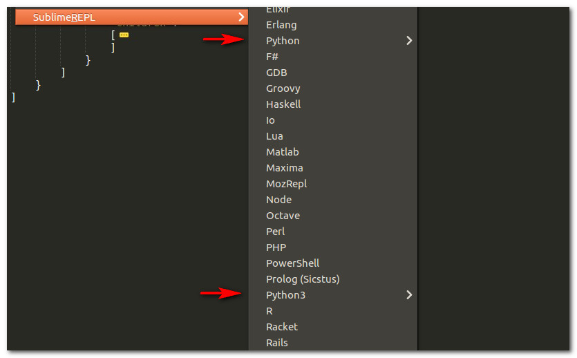
### 设置快捷键
点击 设置 -> 快捷键设置  添加如图内容就可以使用快捷键执行python脚本了
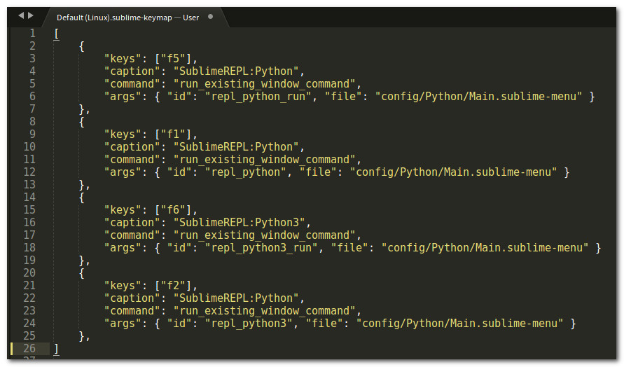  
测试结果如图所示  
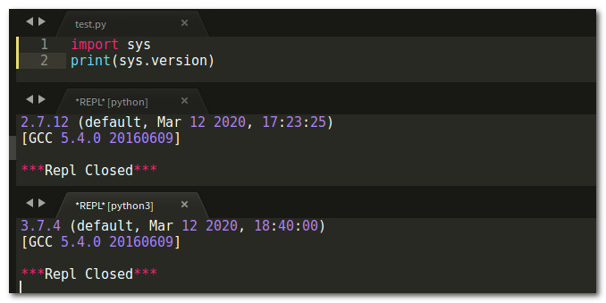
## python语法提示，跳转
### 插件 SublimeCodeIntel
点击 设置 -> Package Control -> Install Package 输入  sublimecode
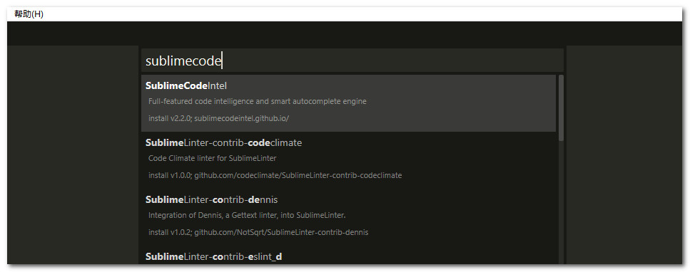
#### 配置
点击 设置 -> Package Settings -> SublimeCodeIntel -> Settings - User 配置成如下内容
```python
{
    "codeintel_language_settings":{
        "Python":{
            "python":"/home/kaixin/.pyenv/versions/2.7.12/envs/py27/bin/python",
            "codeintel_scan_extra_dir": [
                "/home/kaixin/.pyenv/versions/2.7.12/envs/py27/bin",
                "/home/kaixin/.pyenv/versions/2.7.12/lib/python27.zip",
                "/home/kaixin/.pyenv/versions/2.7.12/lib/python2.7",
                "/home/kaixin/.pyenv/versions/2.7.12/lib/python2.7/plat-linux2",
                "/home/kaixin/.pyenv/versions/2.7.12/lib/python2.7/lib-tk",
                "/home/kaixin/.pyenv/versions/2.7.12/lib/python2.7/lib-old",
                "/home/kaixin/.pyenv/versions/2.7.12/lib/python2.7/lib-dynload",
                "/home/kaixin/.pyenv/versions/2.7.12/envs/py27/lib/python2.7/site-packages"
            ],
            "codeintel_scan_files_in_project": true,
            "codeintel_selected_catalogs":[]
        }
	}
}
```
把路径改成自己的python路径，其中 codeintel_scan_extra_dir 填写 sys.path 里的内容，如果有需要可以吧自己的项目路径添加进去
#### 设置快捷键
点击 设置 -> Package Settings -> SublimeCodeIntel -> Key Bindings - User 在列表中添加如下内容
```python
[
	...
	//提示
	{
		"keys":["alt+/"],
		"command":"code_intel_auto_complete"
	},
	//跳转到函数定义
	{
		"keys":["alt+right"],
		"command":"goto_python_definition"
	},
	//返回跳转位置
	{
		"keys":["alt+left"],
		"command":"back_to_python_definition"
	}
]
```
具体快捷键根据自己的习惯设置
#### 设置鼠标快捷键
点击 设置 -> Package Settings -> SublimeCodeIntel -> Mouse Bindings - User 添加如下内容
```python
[
	{
		"button": "button1",
		"modifiers": ["ctrl"],
		"command": "goto_python_definition",
		"press_command": "drag_select"
	},
	{
		"button": "button2",
		"modifiers": ["ctrl"],
		"command": "back_to_python_definition"
	}
]
```
#### 支持python3
点击 设置 -> Package Settings -> SublimeCodeIntel -> Settings - User 增加如下内容
```python
{
    "codeintel_language_settings":{
		...
		"Python3":{
            "python3":"/home/kaixin/.pyenv/versions/3.7.4/envs/py37/bin/python3",
            "codeintel_scan_extra_dir": [
                "/home/kaixin/.pyenv/versions/3.7.4/envs/py37/bin",
                "/home/kaixin/.pyenv/versions/3.7.4/lib/python37.zip",
                "/home/kaixin/.pyenv/versions/3.7.4/lib/python3.7",
                "/home/kaixin/.pyenv/versions/3.7.4/lib/python3.7/plat-linux2",
                "/home/kaixin/.pyenv/versions/3.7.4/lib/python3.7/lib-tk",
                "/home/kaixin/.pyenv/versions/3.7.4/lib/python3.7/lib-old",
                "/home/kaixin/.pyenv/versions/3.7.4/lib/python3.7/lib-dynload",
                "/home/kaixin/.pyenv/versions/3.7.4/envs/py37/lib/python3.7/site-packages",
            ],
            "codeintel_scan_files_in_project": true,
            "codeintel_selected_catalogs":[]
        }
	}
}
```
该配置和python2的配置相同
### 插件 Anaconda
点击 设置 -> Package Control -> Install Package 输入  anaconda
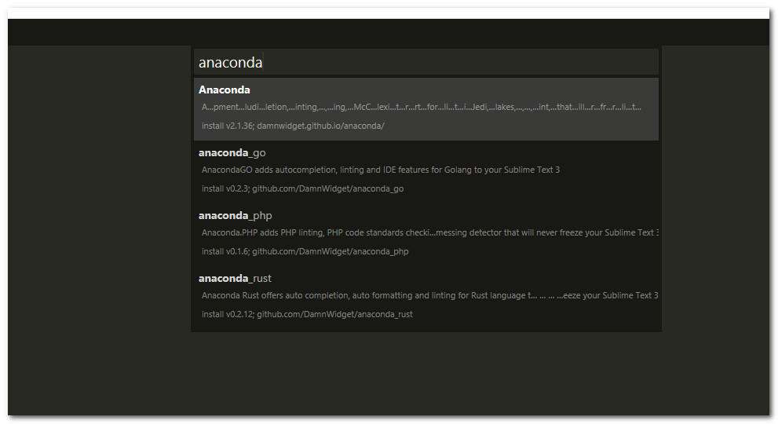
#### 用户配置
```python
{
	//////////////////////////////////////   不常用  //////////////////////////////
	// 工具提示外观  css/popup
	"anaconda_tooltip_theme": "popup",
	// 文档提示在小窗口显示，否则在 console 中显示
	"enable_docstrings_tooltip": true,
	// 切换项目时加载对应项目的配置
	"auto_project_switch": true,
	// 开启编译器  build_systems   如果速度变慢请关闭它
	"auto_python_builder_enabled": false,
	// jsonserver 服务器调试模式和端口
	"jsonserver_debug": false,
    "jsonserver_debug_port": 9999,
    // 关闭超文本规则补全
	"suppress_word_completions": true,
    "suppress_explicit_completions": true,
    // True -> 把函数和类参数补全
    "complete_parameters": false,
    // True 添加所有参数  False 添加必须参数
    "complete_all_parameters": false,
    // 自动格式化文件保存
	"auto_formatting": false,
	// 自动格式化文件超时 s
	"auto_formatting_timeout": 2,
	// 格式化忽略这里出现的错误
	"autoformat_ignore": ["E309"],
    // 只修复这里出现的错误
    "autoformat_select": [],
    // McCabe 复杂性检查阈值
    "mccabe_threshold": 7,
    // linting 工作模式  always load-save save-only
	"anaconda_linting_behaviour": "save-only",
	// liting 运行前延迟
	"anaconda_linter_delay": 0.5,
	// phantoms 使用主题
	"anaconda_linter_phantoms_theme": "phantom",
	// phantoms 使用模板
	"anaconda_linter_phantoms_template": "default",
	// 如果设置为 True，在保存时显示错误列表
	"anaconda_linter_show_errors_on_save": true,
	// 使用PyLint代替PyFlakes和PEP-8  PyLint 不支持未保存的缓冲区
	"use_pylint": false,
	// PyLint 检查使用的文件
    "pylint_rcfile": false,
    // 检查忽略的错误
    "pylint_ignore": [], // "0201"
    // 使用给定的文件作为 pep8 检查的依据, 忽略下面的 ignore 和 最大长度
	"pep8_rcfile": false,
	// PEP8 代码规范警告设置
    "pep8_error_levels": {"E": "W", "W": "V", "V": "V"},
    // 忽略  from foo import * 的警告
    "pyflakes_ignore_import_*": true,
    // linting 启动时检查导入
    "validate_imports": false,
    // 调试模式  false or profiler
    "anaconda_debug": false,
    // 测试命令
    "test_command": "nosetests",

    /////////////////////////////////////  静态类型检查  ////////////////////////////////
    // True 开启静态类型检查
    "mypy": false,
    // 检查脚本路径
    "mypy_mypypath": "",
    // True mypy 不会跟随导出到.py文件  静默导入
    "mypy_silent_imports": false,
    // 与静默导入相似，但是报告错误
    "mypy_almost_silent": false,
    // 不使用静默导入  禁止警告
    "mypy_suppress_stub_warnings": true,
    // 使用python2 的模式
    "mypy_py2": false,
    // 不允许带有类型注释的函数调用没有类型注释的函数
    "mypy_disallow_untyped_calls": false,
    // 不允许创建没有类型注释的函数
    "mypy_disallow_untyped_defs": false,
    // 没有类型注释的函数内部 类型检查
    "mypy_check_untyped_defs": false,
    // 启用快速解析  实际上比较慢 但支持新特性
    "mypy_fast_parser": false,

    /////////////////////////////////  常用设置  ///////////////////////////////////////////////
	// 自动显示语法提示框
	"enable_signatures_tooltip": true,
	// 合并语法提示和文档的输出
	"merge_signatures_and_doc": true,
	// 开启语法提示
	"display_signatures": true,
	// 禁用 completion  显示提示选项的类型  function  class 等等
	"disable_anaconda_completion": false,
	// 使用 table 键插入参数， 只在空括号之间工作
	"parameters_completion_on_keypress": true,
	// 开启 linting  标出错误
	"anaconda_linting": true,
	// 如果设置为 True； linting 不会再打字的时候去除痕迹
	"anaconda_linter_persistent": true,
	// 在错误的行前面显示 标识符
	"anaconda_gutter_marks": true,
	// 标识符的样式  'alpha', 'bright', 'dark', 'hard', "retina", 'simple', 'basic'
	"anaconda_gutter_theme": "hard",
	// linting 语法显示错误样式
	// 'outline' 'fill', 'solid_underline', 'stippled_underline', 'squiggly_underline', 'none'
	"anaconda_linter_mark_style": "none",
	// linting 在错误处显示下划线
	"anaconda_linter_underlines": true,
	// linting 语法错误嵌入到文本中
	"anaconda_linter_phantoms": true,
	// 开启 PEP8 语法检查
	"pep8": true,
	// 忽略检查的 PEP8 代号
	"pep8_ignore":
    [
    	"E302",
    	"E303",
    	"E305",
        "E309",
        "E402",
        "W292",
        "W391"
    ],
    // PEP8 最大行长度
    "pep8_max_line_length": 100,
    // 打开PEP257 检查
    "pep257": false,
    // 忽略这里出现的错误
    "pep257_ignore":
    [
        "D203",
        "D209"
    ],
    // 检查忽略的 名字
    "pyflakes_ignore":[],
    // 忽略特定的错误类型
    "pyflakes_explicit_ignore":
    [
        // "Redefined",
        "UnusedImport",
        // "UndefinedName",
        // "UndefinedLocal",
        // "UnusedVariable,",
        // "UndefinedExport",
        // "DuplicateArgument",
        // "RedefinedWhileUnused"
    ],
	//"python_interpreter": "/home/kaixin/.pyenv/versions/py37/bin/python",
	// 额外的路径
	"extra_paths":
	[],
}
```
#### 项目配置
```python
{
	"build_systems":
	[
		{
			"file_regex": "^[ ]*File \"(...*?)\", line ([0-9]*)",
			"name": "Anaconda Python Builder",
			"selector": "source.python",
			"shell_cmd": "\"/home/kaixin/.pyenv/versions/py37/bin/python\" -u \"$file\""
		}
	],
	"settings":
	{
		"extra_paths":
		[
			"/home/kaixin/.sublime_text"
		],
		"python_interpreter": "tcp://192.168.1.126:52122"
	}
}
```
#### 设置快捷键
```python
[
    // anaconda
    // 回跳
    {
        "command": "jump_back",
        "keys": ["ctrl+alt+b"]
    },
    // 转到定义
    {
        "command": "anaconda_goto",
        "keys": ["ctrl+alt+g"],
        "context": [
            {"key": "selector", "operator": "equal", "operand": "source.python"}
        ]
    },
    // 查找使用
    {
        "command": "anaconda_find_usages",
        "keys": ["ctrl+alt+f"],
        "context": [
            {"key": "selector", "operator": "equal", "operand": "source.python"}
        ]
    },
    // 查找文档
    {
        "command": "anaconda_doc",
        "keys": ["ctrl+alt+d"],
        "context": [
            {"key": "selector", "operator": "equal", "operand": "source.python"}
        ]
    },
    // 整理文件格式 PEP8
    {
        "command": "anaconda_auto_format",
        "keys": ["ctrl+shift+s"],
        "context": [
            {"key": "selector", "operator": "equal", "operand": "source.python"}
        ]
    },
    // 显示函数必选参数
    {
        "command": "anaconda_fill_funcargs",
        "keys": ["tab"],
        "context": [
            {"key": "selector", "operator": "equal", "operand": "source.python"},
            {"key": "anaconda_insert_funcargs"}
        ]
    },
    // 显示函数所有参数
    {
        "command": "anaconda_fill_funcargs",
        "keys": ["ctrl+tab"],
        "args": {"all": true},
        "context": [
            {"key": "selector", "operator": "equal", "operand": "source.python"},
            {"key": "anaconda_insert_funcargs"}
        ]
    },
    // 转到 任务？作业
    {
        "command": "anaconda_goto_assignment",
        "keys": ["ctrl+alt+a"]
    },
    // 重命名对象以及其所有的引用
    {
        "command": "anaconda_rename",
        "keys": ["ctrl+alt+r"]
    },
    // 显示文件中所有的错误
    {
        "command": "anaconda_get_lines",
        "keys": ["ctrl+alt+e"]
    },
    // 调到文件中下一个错误行
    {
        "command": "anaconda_next_lint_error",
        "keys": ["ctrl+alt+n"]
    },
    // 调到文件中上一个错误行
    {
        "command": "anaconda_prev_lint_error",
        "keys": ["ctrl+alt+p"]
    }
]
```
#### 设置鼠标快捷键
```python
[
	{
		"button": "button1",
		"modifiers": ["ctrl"],
		"command": "anaconda_goto",
		"context": [
            {
            	"key": "selector",
            	"operator": "equal",
            	"operand": "source.python"
            }
        ],
		"press_command": "drag_select"
	},
	{
		"button": "button2",
		"modifiers": ["ctrl"],
		"command": "jump_back",
		"press_command": "drag_select"
	}
]
```
## git 支持
### 安装 sublime Merge
进入sublime官网下载。[下载地址](https://www.sublimemerge.com/download)
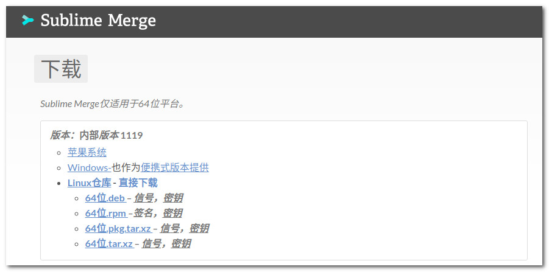