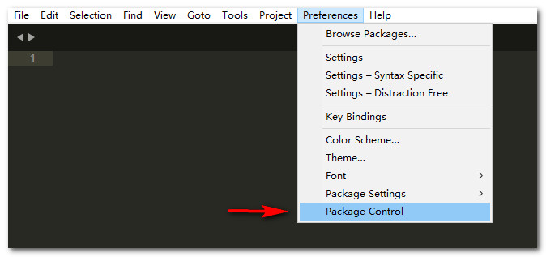
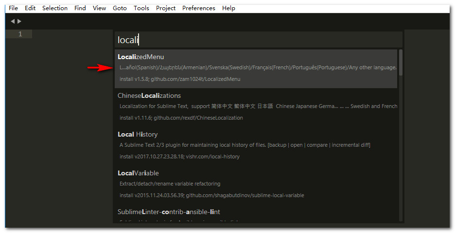
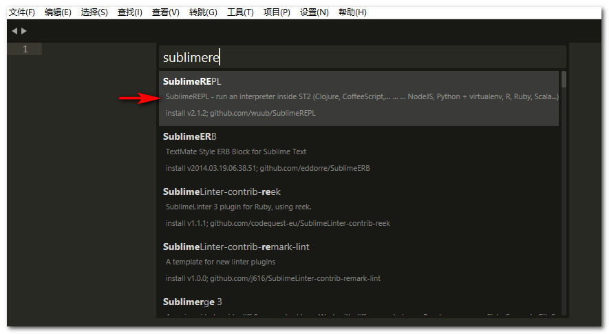
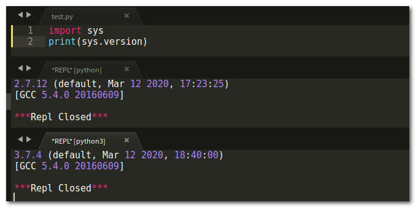
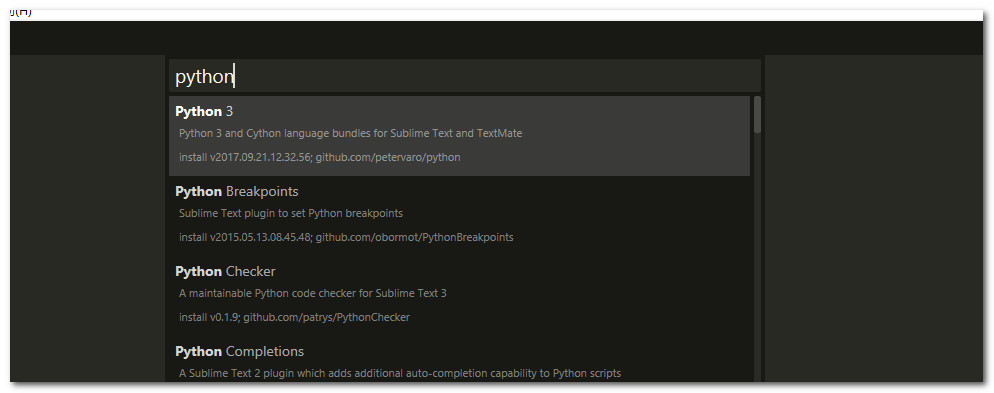
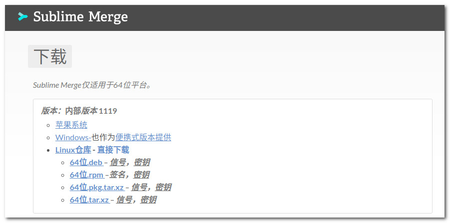

# sublime 安装配置(ubuntu)

## 下载
进入sublime官网点击Linux64位下载(根据自己的系统选择)，[下载地址](http://www.sublimetext.com/3)。

## 安装
1. 把压缩包解压到用户主目录
2. 更改解压后的文件夹名称
3. 把可执行程序链接到系统搜索路径
4. 执行


## 安装 package control
打开sublime点击tools点击install package control，待安装完后选择preferences可以看到结果。



## 支持中文
点击 preferences -> package control -> install package 输入 localizedMenu 点击安装

安装完成后点击 preferences -> languages -> 简体中文


## 插件 SublimeREPL
点击 设置 -> package control -> install package 输入 sublimere



## 配置sublime支持 py2 and py3
### 更改配置文件
点击 设置 -> 浏览插件目录 -> SublimeREPL -> config -> Python 打开文件 Main.sublime-menu
根据以下配置更改文件内容，其中python2和python3的路径根据自己的安装路径修改
```python
[
    {
        "id": "tools",
        "children":
        [
            {
                "caption": "SublimeREPL",
                "mnemonic": "R",
                "id": "SublimeREPL",
                "children":
                [
                    {
                        "caption": "Python",
                        "id": "Python",
                        "children":
                        [
                            {
                                "command": "repl_open",
                                "caption": "Python",
                                "id": "repl_python",
                                "mnemonic": "P",
                                "args": {
                                    "type": "subprocess",
                                    "encoding": "utf8",
                                    "cmd": ["/home/kaixin/.pyenv/versions/py27/bin/python", "-i", "-u"],
                                    "cwd": "$file_path",
                                    "syntax": "Packages/Python/Python.tmLanguage",
                                    "external_id": "python",
                                    "extend_env": {"PYTHONIOENCODING": "utf-8"}
                                }
                            },
                            {
                                "command": "python_virtualenv_repl",
                                "id": "python_virtualenv_repl",
                                "caption": "Python - virtualenv"
                            },
                            {
                                "command": "repl_open",
                                 "caption": "Python - PDB current file",
                                 "id": "repl_python_pdb",
                                 "mnemonic": "D",
                                 "args": {
                                    "type": "subprocess",
                                    "encoding": "utf8",
                                    "cmd": ["/home/kaixin/.pyenv/versions/py27/bin/python", "-i", "-u", "-m", "pdb", "$file_basename"],
                                    "cwd": "$file_path",
                                    "syntax": "Packages/Python/Python.tmLanguage",
                                    "external_id": "python",
                                    "extend_env": {"PYTHONIOENCODING": "utf-8"}
                                }
                            },
                            {
                                "command": "repl_open",
                                 "caption": "Python - RUN current file",
                                 "id": "repl_python_run",
                                 "mnemonic": "R",
                                 "args": {
                                    "type": "subprocess",
                                    "encoding": "utf8",
                                    "cmd": ["/home/kaixin/.pyenv/versions/py27/bin/python", "-u", "$file_basename"],
                                    "cwd": "$file_path",
                                    "syntax": "Packages/Python/Python.tmLanguage",
                                    "external_id": "python",
                                    "extend_env": {"PYTHONIOENCODING": "utf-8"}
                                }
                            },
                            {
                                "command": "repl_open",
                                "caption": "Python - IPython",
                                "id": "repl_python_ipython",
                                "mnemonic": "I",
                                "args": {
                                    "type": "subprocess",
                                    "encoding": "utf8",
                                    "autocomplete_server": true,
                                    "cmd": {
                                        "osx": ["/home/kaixin/.pyenv/versions/py27/bin/python", "-u", "${packages}/SublimeREPL/config/Python/ipy_repl.py"],
                                        "linux": ["/home/kaixin/.pyenv/versions/py27/bin/python", "-u", "${packages}/SublimeREPL/config/Python/ipy_repl.py"],
                                        "windows": ["/home/kaixin/.pyenv/versions/py27/bin/python", "-u", "${packages}/SublimeREPL/config/Python/ipy_repl.py"]
                                    },
                                    "cwd": "$file_path",
                                    "syntax": "Packages/Python/Python.tmLanguage",
                                    "external_id": "python",
                                    "extend_env": {
                                        "PYTHONIOENCODING": "utf-8",
                                        "SUBLIMEREPL_EDITOR": "$editor"
                                    }
                                }
                            }
                        ]
                    },
                    {
                        "caption": "Python3",
                        "id": "Python3",
                        "children":
                        [
                            {
                                "command": "repl_open",
                                "caption": "Python3",
                                "id": "repl_python3",
                                "mnemonic": "P",
                                "args": {
                                    "type": "subprocess",
                                    "encoding": "utf8",
                                    "autocomplete_server": true,
                                    "cmd": ["/home/kaixin/.pyenv/versions/py37/bin/python", "-i", "-u"],
                                    "cwd": "$file_path",
                                    "syntax": "Packages/Python/Python.tmLanguage",
                                    "external_id": "python3",
                                    "extend_env": {"PYTHONIOENCODING": "utf-8"}
                                }
                            },
                            {
                                "command": "repl_open",
                                "caption": "Python3 - PDB current file",
                                "id": "repl_python3_pdb",
                                "mnemonic": "D",
                                "args": {
                                    "type": "subprocess",
                                    "encoding": "utf8",
                                    "cmd": ["/home/kaixin/.pyenv/versions/py37/bin/python3", "-i", "-u", "-m", "pdb", "$file_basename"],
                                    "cwd": "$file_path",
                                    "syntax": "Packages/Python/Python.tmLanguage",
                                    "external_id": "python3",
                                    "extend_env": {"PYTHONIOENCODING": "utf-8"}
                                }
                            },
                            {
                                "command": "repl_open",
                                "caption": "Python3 - RUN current file",
                                "id": "repl_python3_run",
                                "mnemonic": "R",
                                "args": {
                                    "type": "subprocess",
                                    "encoding": "utf8",
                                    "cmd": ["/home/kaixin/.pyenv/versions/py37/bin/python3", "-u", "$file_basename"],
                                    "cwd": "$file_path",
                                    "syntax": "Packages/Python/Python.tmLanguage",
                                    "external_id": "python3",
                                    "extend_env": {"PYTHONIOENCODING": "utf-8"}
                                }
                            },
                            {
                                "command": "repl_open",
                                "caption": "Python3 - IPython",
                                "id": "repl_python3_ipython",
                                "mnemonic": "I",
                                "args": {
                                    "type": "subprocess",
                                    "encoding": "utf8",
                                    "autocomplete_server": true,
                                    "cmd": {
                                        "osx": ["/home/kaixin/.pyenv/versions/py37/bin/python3", "-u", "${packages}/SublimeREPL/config/Python/ipy_repl.py"],
                                        "linux": ["/home/kaixin/.pyenv/versions/py37/bin/python3", "-u", "${packages}/SublimeREPL/config/Python/ipy_repl.py"],
                                        "windows": ["/home/kaixin/.pyenv/versions/py37/bin/python3", "-u", "${packages}/SublimeREPL/config/Python/ipy_repl.py"],
                                        "ubuntu": ["/home/kaixin/.pyenv/versions/py37/bin/python3", "-u", "${packages}/SublimeREPL/config/Python/ipy_repl.py"]
                                    },
                                    "cwd": "$file_path",
                                    "syntax": "Packages/Python/Python.tmLanguage",
                                    "external_id": "python3",
                                    "extend_env": {
                                        "PYTHONIOENCODING": "utf-8",
                                        "SUBLIMEREPL_EDITOR": "$editor"
                                    }
                                }
                            }
                        ]
                    }
                ]
            }
        ]
    }
]
```
打开 Main.sublime-menu 同目录下的 Default.sublime-commands 文件，在列表的最后增加如下内容
```python
{
	"caption": "SublimeREPL: Python3",
	"command": "run_existing_window_command", "args":
	{
		"id": "repl_python3",
		"file": "config/Python/Main.sublime-menu"
	}
},
{
	"caption": "SublimeREPL: Python3 - PDB current file",
	"command": "run_existing_window_command", "args":
	{
		"id": "repl_python3_pdb",
		"file": "config/Python/Main.sublime-menu"
	}
},
{
	"caption": "SublimeREPL: Python3 - RUN current file",
	"command": "run_existing_window_command", "args":
	{
		"id": "repl_python3_run",
		"file": "config/Python/Main.sublime-menu"
	}
},
{
	"command": "python3_virtualenv_repl",
	"caption": "SublimeREPL: Python3 - virtualenv"
},
{
	"caption": "SublimeREPL: Python3 - IPython",
	"command": "run_existing_window_command", "args":
	{
		"id": "repl_python3_ipython",
		"file": "config/Python/Main.sublime-menu"
	}
}
```
保存后关闭sublime重新打开
点击 工具 -> SublimeREPL 可以看到

### 设置快捷键
点击 设置 -> 快捷键设置  添加如图内容就可以使用快捷键执行python脚本了

测试结果如图所示

## python语法提示，跳转
### 安装插件 SublimeCodeIntel
点击 设置 -> Package Control -> Install Package 输入  sublimecode

### 配置
点击 设置 -> Package Settings -> SublimeCodeIntel -> Settings - User 配置成如下内容
```python
{
    "codeintel_language_settings":{
        "Python":{
            "python":"/home/kaixin/.pyenv/versions/2.7.12/envs/py27/bin/python",
            "codeintel_scan_extra_dir": [
                "/home/kaixin/.pyenv/versions/2.7.12/envs/py27/bin",
                "/home/kaixin/.pyenv/versions/2.7.12/lib/python27.zip",
                "/home/kaixin/.pyenv/versions/2.7.12/lib/python2.7",
                "/home/kaixin/.pyenv/versions/2.7.12/lib/python2.7/plat-linux2",
                "/home/kaixin/.pyenv/versions/2.7.12/lib/python2.7/lib-tk",
                "/home/kaixin/.pyenv/versions/2.7.12/lib/python2.7/lib-old",
                "/home/kaixin/.pyenv/versions/2.7.12/lib/python2.7/lib-dynload",
                "/home/kaixin/.pyenv/versions/2.7.12/envs/py27/lib/python2.7/site-packages"
            ],
            "codeintel_scan_files_in_project": true,
            "codeintel_selected_catalogs":[]
        }
	}
}
```
把路径改成自己的python路径，其中 codeintel_scan_extra_dir 填写 sys.path 里的内容，如果有需要可以吧自己的项目路径添加进去
### 设置快捷键
点击 设置 -> Package Settings -> SublimeCodeIntel -> Key Bindings - User 在列表中添加如下内容
```python
[
	...
	//提示
	{
		"keys":["alt+/"],
		"command":"code_intel_auto_complete"
	},
	//跳转到函数定义
	{
		"keys":["alt+right"],
		"command":"goto_python_definition"
	},
	//返回跳转位置
	{
		"keys":["alt+left"],
		"command":"back_to_python_definition"
	}
]
```
具体快捷键根据自己的习惯设置
### 设置鼠标快捷键
点击 设置 -> Package Settings -> SublimeCodeIntel -> Mouse Bindings - User 添加如下内容
```python
[
	{
		"button": "button1",
		"modifiers": ["ctrl"],
		"command": "goto_python_definition",
		"press_command": "drag_select"
	},
	{
		"button": "button2",
		"modifiers": ["ctrl"],
		"command": "back_to_python_definition"
	}
]
```
## 支持python3语法提示，跳转
### 新增配置
点击 设置 -> Package Settings -> SublimeCodeIntel -> Settings - User 增加如下内容
```python
{
    "codeintel_language_settings":{
		...
		"Python3":{
            "python3":"/home/kaixin/.pyenv/versions/3.7.4/envs/py37/bin/python3",
            "codeintel_scan_extra_dir": [
                "/home/kaixin/.pyenv/versions/3.7.4/envs/py37/bin",
                "/home/kaixin/.pyenv/versions/3.7.4/lib/python37.zip",
                "/home/kaixin/.pyenv/versions/3.7.4/lib/python3.7",
                "/home/kaixin/.pyenv/versions/3.7.4/lib/python3.7/plat-linux2",
                "/home/kaixin/.pyenv/versions/3.7.4/lib/python3.7/lib-tk",
                "/home/kaixin/.pyenv/versions/3.7.4/lib/python3.7/lib-old",
                "/home/kaixin/.pyenv/versions/3.7.4/lib/python3.7/lib-dynload",
                "/home/kaixin/.pyenv/versions/3.7.4/envs/py37/lib/python3.7/site-packages",
            ],
            "codeintel_scan_files_in_project": true,
            "codeintel_selected_catalogs":[]
        }
	}
}
```
该配置和python2的配置相同
### 安装插件
点击 设置 -> Package Control -> Install Package 输入  python

安装之后sublime就可以支持python 3 语法

### 切换语法
使用的时候注意切换语法，语法在右下角设置。

## git 支持
### 安装 sublime Merge
进入sublime官网下载。[下载地址](https://www.sublimemerge.com/download)
